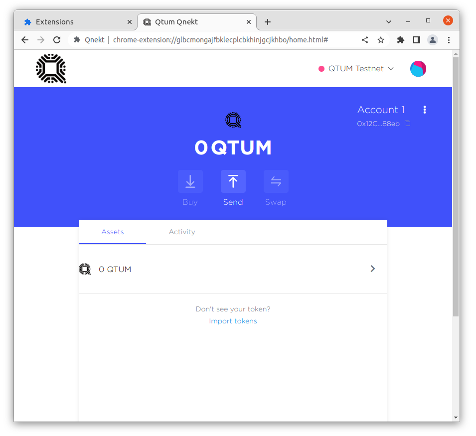
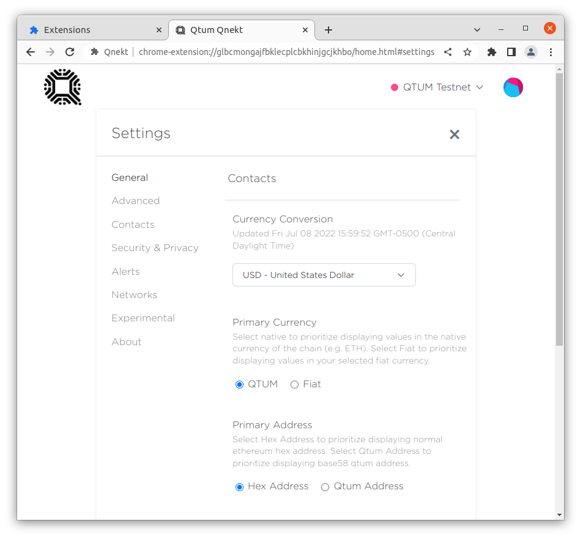
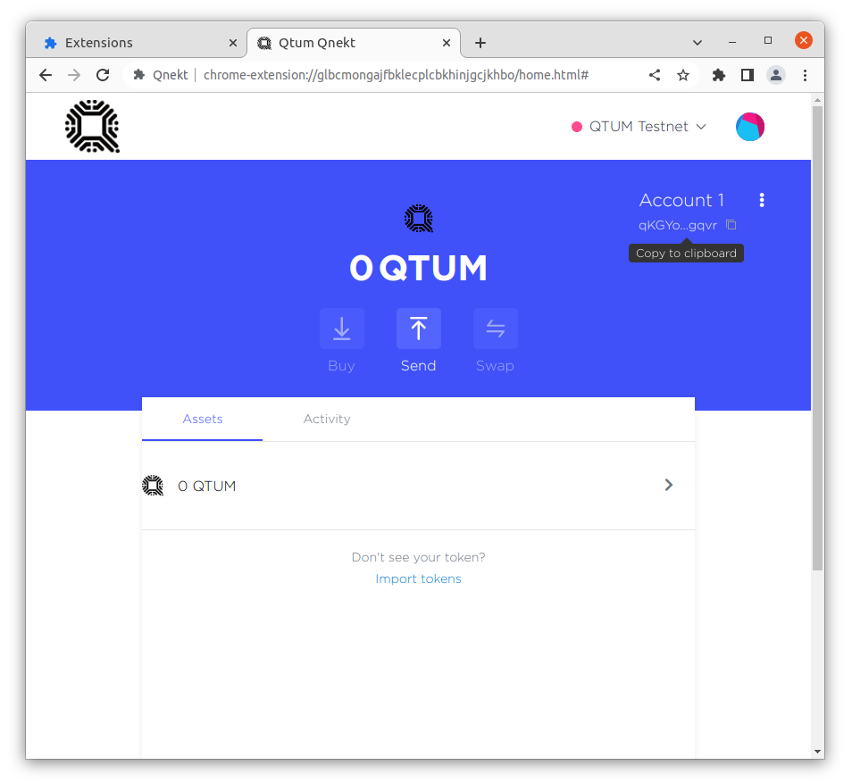
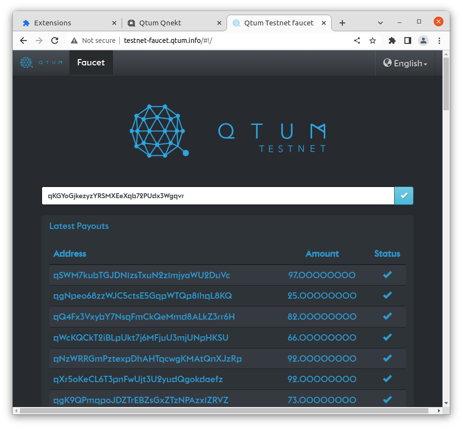
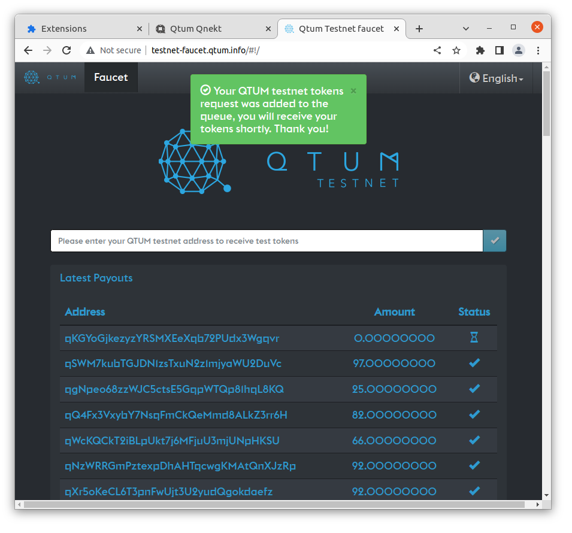
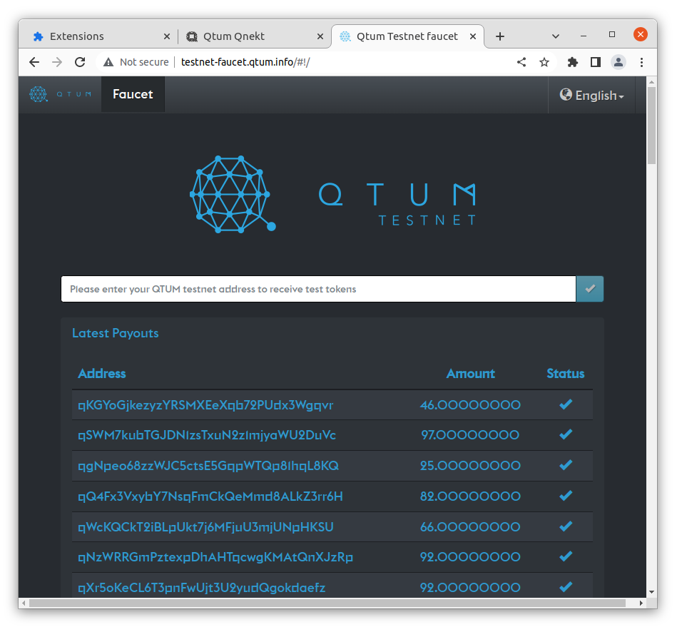
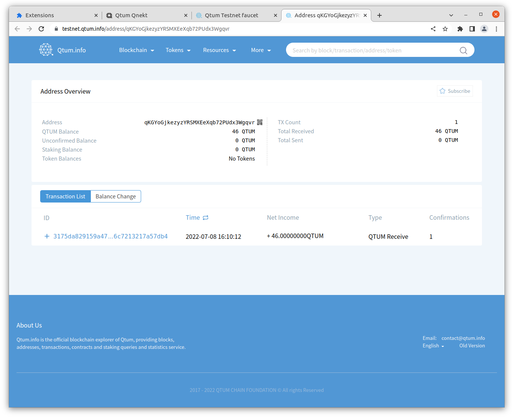
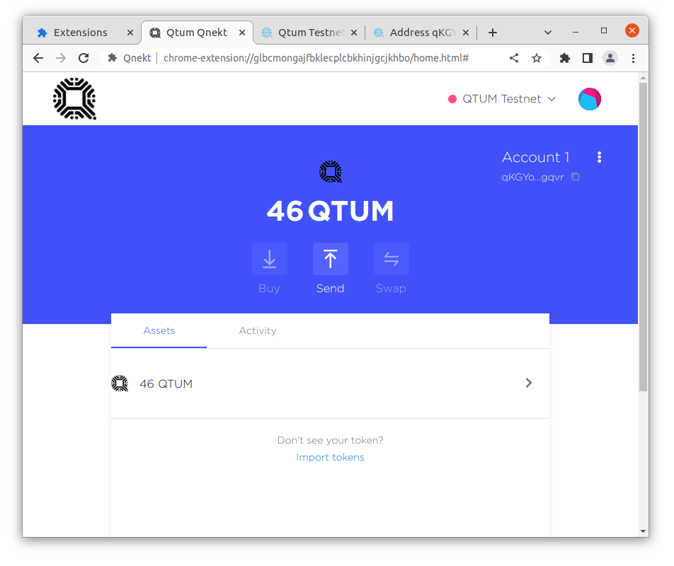

# Getting testnet coins into Qnekt

Now that Qnekt is setup, lets get some Testnet Qtum into your new wallet

The Testnet faucet needs your address in base58 format, lets configure Qnekt to display that by going to settings and selecting Qtum Address under Primary Address

Now you can close out of settings by clicking the X at the top right and copy your base58 address

Open up the [Testnet faucet](http://testnet-faucet.qtum.info/) and paste your base58 address into the box and submit it

A modal should popup confirming your request

After a few seconds, you should see the faucet send you some testnet Qtum

You can click the link to open up and view the transaction on the [testnet explorer](https://testnet.qtum.info/address/qKGYoGjkezyzYRSMXEeXqb72PUdx3Wgqvr)

Now when you navigate back to Qnekt, your testnet balance should be updated

