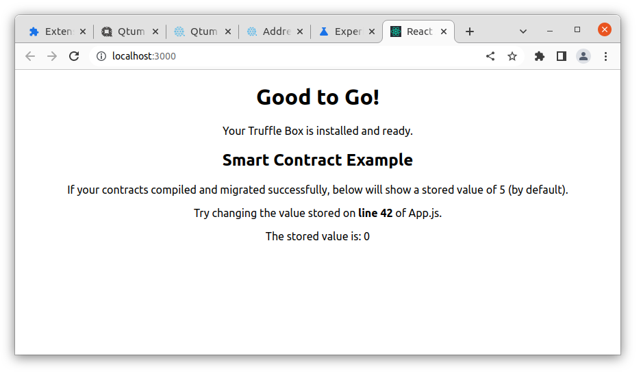
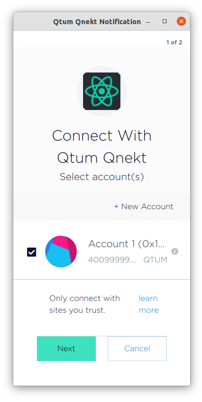
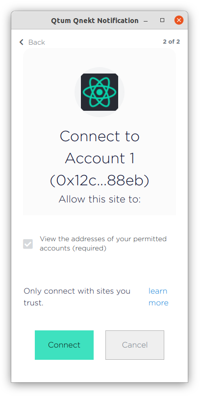
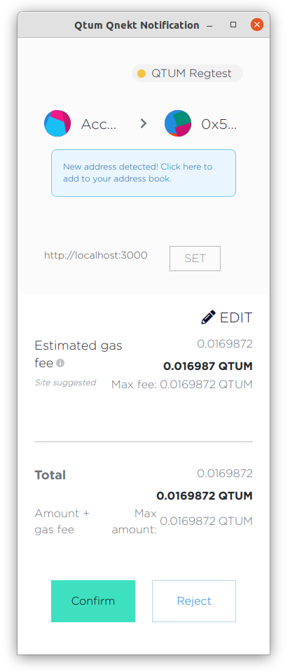
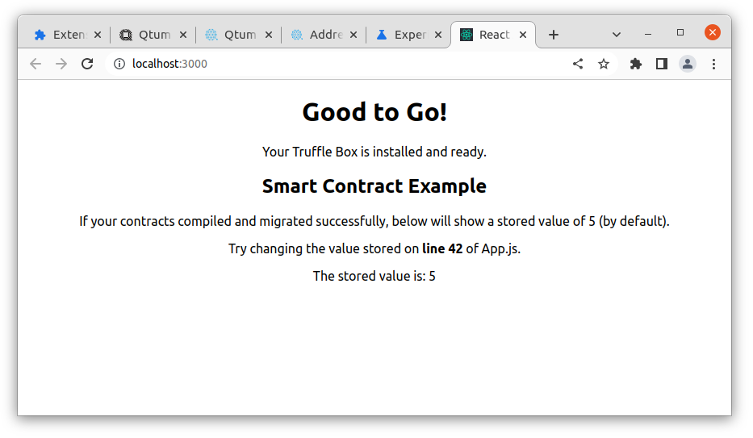

# Connecting react-box to regtest

Now that Qnekt is connected to your local regtest instance and you have a balance, we can launch react-box and connect to it via Qnekt/Web3.

In a previous section, we did [`truffle migrate --network regtest`](/part2/truffle.md#truffle-migrate) which generated some contract artifacts.

We need to copy those into the [`client/src`](https://github.com/qtumproject/react-box/tree/master/client/src) folder in [`react-box`](https://github.com/qtumproject/react-box/)

```bash
react-box> cp -a build/contracts client/src/
cd client
npm run start
```

The Dapp should open in your browser



Qnekt will prompt you to connect your account to the Dapp



After confirming



A transaction will be submitted



And after being confirmed, the stored value in the smart contract will be updated from 0 to 5



Congratulations, now you have deployed a contract via truffle, connected it to Qnekt and signed a transaction.
